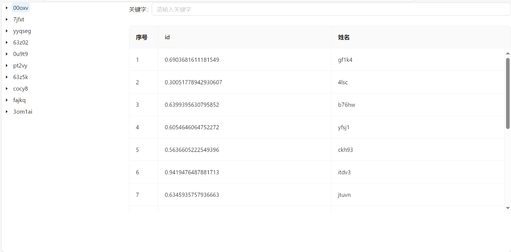

# Hixtrip FE Online

## 准备

- fork 此仓库
- 根据如下要求实现相关代码
- 完成要求
  - 提交`pull request`
  - 提供页面截图

## 需求

1. 目前已经有`src/api/user.ts` 以及 `src/api/org.ts` 两个 API
2. 需要实现如下效果界面：




> 功能要求：
- 不限 ```React``` 或者 ```Vue```
- 需要拆分 `OrgTree` 以及 `UserTable` 两个组件
  - 两个组件自己维护相关的数据。
  - 体现两个组件的互相通信。
- 组织架构根据点上级节点进行查询子级节点实现异步加载。
- 用户 ```Table ``` 数据跟据点击 ```组织架构树形节点``` 以及 ```输入搜索关键字``` 查询。
  - 需要考虑防抖节流等功能点
- 风格不限
  - 示例图仅仅是效果展示，不需要完全符合。
  - 可以使用 ```UI Framework```, 如 ```ant-design```, ```element-ui```等
  - 如果不用```UI Framework```, 可以直接用原生的```<ul> <li>```, ```<table>``` 实现，不用实现相关的CSS样式, 可以加分。

## 其他简答题

### 如何将如下的`JSON`正确解析成 `Object`
```json
{
  "userId": 111323290434354540545
}
```
1.使用JSON.parser(json)
### 前端需要*稳定*每隔`1s`向服务端请求`API`, 请问如何实现？
使用setTimeout在每次异步请求的finally处执行，等待异步请求完，再隔一秒调用请求
### 什么情况下，你会为你的项目引入状态管理库，比如`Redux`, `Pinia`, 可以简述一下起到了什么作用么？
当多个组件需要访问和修改相同数据是数据的时候，就需要用到状态管理库，使用统一的方式来维护数据，减少代码冗余，利于数据维护，使得数据管理变得简单高效。
### 为什么`ESM`与`CJS`不能兼容？
1.ESM 使用 import 和 export 关键字来导入和导出模块，而 CJS 使用 require() 和 module.exports 或 exports 来实现相同的功能。因此，代码中使用不同的语法会导致语法错误。
2.ESM 在解析阶段会先进行静态分析，即在代码执行之前就会确定模块的依赖关系和加载顺序。而 CJS 是在运行时动态加载模块，可以根据代码逻辑来决定加载顺序。这意味着在 CJS 中，你可以在条件语句中使用 require()，而在 ESM 中这是不允许的。
3.ESM 中的模块是静态的，它们会在自己的作用域中运行，并且默认是严格模式。而 CJS 模块是动态的，它们在同一个作用域中运行，并且不会默认启用严格模式。这些差异可能导致在两种模块系统之间共享变量时出现问题。
